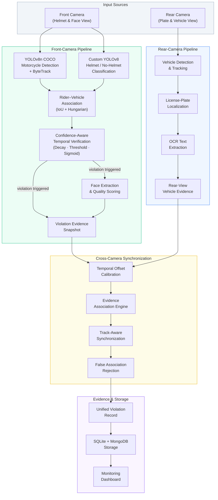
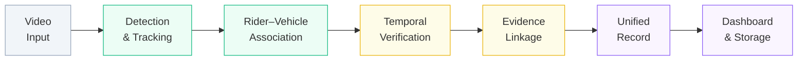

<p align="center">
  
</p>

<h1 align="center">TrafficVision-AI</h1>

<h3 align="center">An Integrated Dual-Camera Framework for Context-Aware Motorcycle Helmet Violation Detection with Confidence-Aware Temporal Verification</h3>

<p align="center">
  TrafficVision-AI moves beyond isolated frame-level helmet detection by combining rider–vehicle association, confidence-weighted temporal evidence aggregation, and cross-camera evidence linkage to produce reliable, traceable violation records.
</p>

<p align="center">
  <a href="#overview">Overview</a> •
  <a href="#system-architecture">Architecture</a> •
  <a href="#key-features">Features</a> •
  <a href="#how-the-pipeline-works">Pipeline</a> •
  <a href="#getting-started">Installation</a> •
  <a href="#usage">Usage</a> •
  <a href="#research-contributions">Research</a> •
  <a href="#citation">Citation</a>
</p>

<p align="center">
  
  
  
  
  
  
  
</p>

---

<p align="center">
  
  <br/>
  <em>Monitoring dashboard — unified violation evidence, confidence scoring, and event history</em>
</p>

---

## Overview

Most published motorcycle helmet detection systems operate at the individual frame level: a YOLO model classifies a detected head as *helmet* or *no-helmet*, and that single classification becomes the final violation decision. This approach is fast but fragile — it cannot distinguish which rider belongs to which motorcycle, it treats a 0.51-confidence detection identically to a 0.97-confidence detection, and a single ambiguous frame can trigger a false violation.

**TrafficVision-AI treats helmet violation monitoring as an evidence-verification problem, not only an object-detection problem.**

The system integrates three mechanisms that together produce more reliable violation evidence:

| Mechanism | What It Addresses |
|---|---|
| **Rider–Vehicle Association** | Correctly attributes each detected rider to the motorcycle they are operating, even in multi-vehicle scenes |
| **Confidence-Aware Temporal Verification** | Aggregates detection evidence across multiple frames with exponential temporal decay, producing a continuous violation probability rather than a binary flag |
| **Cross-Camera Evidence Linkage** | Synchronizes front-view violation evidence (face, helmet status) with rear-view vehicle evidence (license plate, vehicle identity) into a single unified record |

The result is a violation record that carries not just a label, but the spatial association method, temporal confidence trajectory, and cross-camera evidence trail behind each decision.

---

## Why This Project?

Real-world traffic monitoring in South and Southeast Asian urban environments presents challenges that simple frame-level detection cannot reliably address:

- **Ambiguous rider–motorcycle relationships** — In dense traffic, multiple motorcycles travel in close proximity. A naive spatial heuristic can attribute a rider to the wrong vehicle.
- **Detection confidence fluctuation** — Occlusion, motion blur, lighting variation, and partial visibility cause per-frame detection confidence to fluctuate, producing both false positives and false negatives at the single-frame level.
- **Fragmented evidence across viewpoints** — A front-facing camera captures helmet status and rider face, but not the license plate. A rear-facing camera captures the plate, but not the helmet status. Neither camera alone produces a complete violation record.
- **Temporal inconsistency** — A rider may be partially occluded in one frame but clearly visible in the next. Single-frame decisions discard this temporal context.

TrafficVision-AI addresses these through:

```
Rider Context  +  Temporal Verification  +  Cross-Camera Linkage  =  Unified Violation Evidence
```

---

## Key Features

| Feature | Description |
|---|---|
| **Motorcycle & Rider Detection** | YOLOv8-based detection with ByteTrack persistent identity tracking |
| **Helmet / No-Helmet Classification** | Custom-trained YOLO model classifying rider head regions |
| **IoU + Hungarian Rider–Vehicle Association** | Globally optimal bipartite matching between detected riders and motorcycles using Intersection-over-Union scoring with centroid fallback |
| **Confidence-Aware Temporal Verification** | Exponentially decaying sliding-window scoring that produces a violation probability (sigmoid-mapped), not just a binary flag |
| **Multi-Frame Evidence Aggregation** | Per-rider observation windows with configurable decay, threshold, and minimum confidence |
| **Front-Camera Violation Processing** | Face extraction, quality scoring, evidence snapshot generation |
| **Rear-Camera Vehicle Processing** | License-plate localization and OCR-based text extraction |
| **Intelligent Cross-Camera Synchronization** | Temporal offset calibration, confidence-aware multi-factor evidence association, track-aware synchronization, and false association rejection |
| **Unified Violation Records** | Single records linking front-view violation evidence to rear-view vehicle identity |
| **Evidence Storage** | SQLite + MongoDB dual-backend storage with telemetry JSON columns |
| **Professional Monitoring Dashboard** | React 19 + TailwindCSS interface with violation review, live monitoring, upload center, penalty system, and research evaluation views |
| **Video Normalization** | FFmpeg-based VFR-to-CFR conversion for reliable processing of mobile-device footage |

---

## System Architecture



The architecture separates the system into two parallel camera pipelines that converge at a cross-camera synchronization engine. The front-camera pipeline handles detection, rider–vehicle association, temporal verification, and violation evidence capture. The rear-camera pipeline handles vehicle detection, license-plate localization, and OCR. The synchronization engine links evidence from both cameras into unified violation records stored in a dual-backend database and presented through a React-based monitoring dashboard.

---

## How the Pipeline Works

### 1. Video Input & Normalization
**Input:** Raw video file (MP4, MOV, AVI) uploaded through the dashboard.
**Processing:** FFmpeg converts variable-frame-rate mobile footage to constant 25fps for reliable OpenCV frame indexing.
**Output:** Normalized video file ready for frame-level processing.

### 2. Dual-Model Inference
**Input:** Each stride frame (stride auto-computed: every frame for short videos, every 3rd frame for longer ones).
**Processing:** Two YOLO models run per frame — YOLOv8n (COCO classes: motorcycle, bicycle) with ByteTrack for persistent vehicle identity, and a custom-trained YOLO model for helmet/no-helmet head classification.
**Output:** Per-frame lists of motorcycle detections (with track IDs) and rider-head detections (with labels and confidence scores).

### 3. Rider–Vehicle Association
**Input:** Motorcycle detection boxes and rider-head detection boxes from the current frame.
**Processing:** IoU cost matrix is computed for all (motorcycle, rider) pairs. The Hungarian algorithm (scipy `linear_sum_assignment`) solves the globally optimal one-to-one assignment. Assignments with IoU ≥ 0.05 are accepted; unmatched motorcycles fall back to centroid-based association.
**Output:** Each motorcycle is paired with its associated rider(s), each labeled with association method and IoU score.

### 4. Confidence-Aware Temporal Verification
**Input:** Per-frame (label, confidence) observations for each (track_id, rider_idx) pair.
**Processing:** A sliding window (max 10 stride-frames) maintains observations with exponential temporal decay (factor 0.85). Violation and compliance scores are computed as confidence-weighted sums. The net score is mapped through a sigmoid to produce a violation probability.
**Decision:** Violation triggers when the net score ≥ 1.5 (requires multiple high-confidence no-helmet observations; low-confidence detections contribute less evidence).
**Output:** `VerificationResult` containing `should_trigger`, `violation_probability`, `net_score`, and full window snapshot for audit.

### 5. Front-View Violation Evidence Capture
**Input:** Triggered violation and the associated rider crop.
**Processing:** Haar cascade face detection on the rider region, quality scoring (sharpness, brightness, size, frontal pose), and enhancement. Annotated evidence snapshot is saved.
**Output:** Face image path, evidence snapshot, and violation metadata.

### 6. Rear-View Vehicle Evidence Processing
**Input:** Rear-camera video and temporal sync plan calibrated to the front camera.
**Processing:** Vehicle detection and tracking, license-plate localization, multi-frame OCR with temporal voting for plate-text stability.
**Output:** Plate image, plate text, confidence score, and rear-view evidence frame.

### 7. Cross-Camera Evidence Linkage
**Input:** Front-view violation evidence and rear-view vehicle evidence.
**Processing:** Temporal offset calibration aligns camera timelines. A confidence-aware multi-factor association engine matches front violations to rear evidence using temporal proximity, track continuity, and spatial consistency. False associations are rejected based on configurable confidence thresholds.
**Output:** Unified violation record linking helmet violation evidence to vehicle identity.

### 8. Storage & Dashboard Presentation
**Input:** Unified violation records with all metadata and evidence paths.
**Processing:** Records are persisted in SQLite (via Flask-SQLAlchemy) and MongoDB, with telemetry JSON columns storing association method, IoU score, violation probability, temporal net score, and window snapshots.
**Output:** Accessible through the React monitoring dashboard for review, filtering, and analysis.

---

## Core Research Mechanisms

### A. Rider–Vehicle Association — IoU + Hungarian Matching

**Problem:** Standard helmet detection systems either skip rider–vehicle association entirely (treating every detected head as a standalone violation) or use a centroid-in-bounding-box heuristic with a fixed pixel margin. The centroid approach fails in three real-world conditions common in dense urban traffic:

1. **Adjacent motorcycles** — A rider's centroid can satisfy the margin check for two neighboring motorcycles simultaneously, causing order-dependent, non-deterministic assignment.
2. **Partially occluded vehicles** — Truncated bounding boxes at frame edges cause valid riders to fall outside the fixed margin.
3. **Multiple riders per motorcycle** — Pillion riders from adjacent motorcycles can be incorrectly included within another vehicle's margin.

**Solution:** `RiderVehicleAssociator` in `ml/rider_association.py` computes the Intersection-over-Union (IoU) metric for every (motorcycle, rider) pair, builds an N×M cost matrix, and applies the Hungarian algorithm for globally optimal one-to-one assignment.

**Fallback hierarchy:**
1. IoU + Hungarian (default; O(N³) for N ≤ 30 objects)
2. IoU + Greedy (if scipy unavailable)
3. Centroid fallback per motorcycle (for zero-IoU edge cases)
4. Full centroid fallback (N > 30 objects; performance guard)

Each assignment carries an `association_method` and `iou_score` in the telemetry record, enabling ablation analysis.

### B. Confidence-Aware Temporal Verification

**Problem:** The binary consecutive-frame counter treats a detection at confidence 0.51 identically to one at 0.97. An observation from 10 frames ago carries the same weight as the current frame. The output is True/False with no probability estimate.

**Solution:** `TemporalViolationVerifier` in `ml/temporal_verifier.py` maintains a per-rider sliding window of observations with exponential temporal decay:

```
VIOLATION_SCORE  = Σ [decay^age × conf]   for no_helmet observations
COMPLIANCE_SCORE = Σ [decay^age × conf]   for helmet observations
NET_SCORE        = VIOLATION_SCORE − COMPLIANCE_SCORE
VIOLATION_PROB   = sigmoid(NET_SCORE)
TRIGGER          = (NET_SCORE ≥ 1.5)
```

**Key properties:**
- Two high-confidence (≥0.85) back-to-back no_helmet detections → NET ≈ 1.62 → triggers
- Two marginal (≈0.51) detections → NET ≈ 0.97 → does not trigger (false positive suppressed)
- A subsequent high-confidence helmet detection suppresses the violation score (bidirectional scoring)
- Observations decay by factor 0.85 per stride-frame (~20% weight retained after 1.2 seconds)

### C. Cross-Camera Evidence Linkage

**Problem:** The front camera captures helmet status and rider face but not the license plate. The rear camera captures the plate but not the helmet. Naive timestamp matching fails when cameras have different frame rates, timing offsets, or network jitter.

**Solution:** The synchronization engine in `ml/sync_engine.py` implements:

- **Temporal offset calibration** — Configurable or adaptive offset between front and rear camera timelines
- **Confidence-aware multi-factor association** — Evidence matching based on temporal proximity, track continuity, and spatial consistency
- **Multi-frame temporal fusion with voting** — Plate-text stabilization across multiple rear-camera frames
- **False association rejection** — Configurable confidence thresholds to reject weak matches
- **Track-aware synchronization** — Persistent vehicle identity tracking across the synchronization boundary

Each synchronization decision is logged with explainable reasoning for research audit.

---

## Visual Pipeline



---

## Technology Stack

| Layer | Technologies |
|---|---|
| **Detection Models** | YOLOv8n (Ultralytics) — COCO motorcycle/bicycle tracking; Custom YOLOv8 — helmet/no-helmet classification |
| **Object Tracking** | ByteTrack (via Ultralytics tracker integration) |
| **Association Algorithm** | IoU computation + Hungarian algorithm (scipy `linear_sum_assignment`) with centroid fallback |
| **Temporal Verification** | Custom confidence-weighted sliding-window scorer with exponential decay and sigmoid mapping |
| **Cross-Camera Sync** | Custom temporal offset calibration, multi-factor evidence association, track-aware synchronization |
| **Face Detection** | OpenCV Haar cascade (`haarcascade_frontalface_default.xml`) |
| **License Plate OCR** | EasyOCR |
| **Backend** | Python 3.11, Flask, Flask-SQLAlchemy, Flask-SocketIO |
| **Databases** | SQLite (primary), MongoDB (extended storage) |
| **Frontend** | React 19, Vite 6, TailwindCSS 3, Framer Motion, Lucide Icons, Socket.IO client |
| **Video Processing** | OpenCV, FFmpeg |
| **ML Runtime** | PyTorch, Ultralytics, NumPy, SciPy |

---

## Project Structure

```
TrafficVision-AI/
├── app.py                      # Flask application entry point and API routes
├── database.py                 # SQLAlchemy database models
├── ml/                         # Core AI/vision pipeline modules
│   ├── processor.py            # Main video processing pipeline orchestrator
│   ├── rider_association.py    # IoU + Hungarian rider–vehicle association
│   ├── temporal_verifier.py    # Confidence-aware temporal violation verification
│   ├── camera_workflows.py     # Single and dual-camera processing workflows
│   ├── sync_engine.py          # Cross-camera synchronization engine
│   ├── sync_evaluation.py      # Synchronization evaluation framework
│   ├── plate_intelligence.py   # License-plate localization and OCR
│   ├── live_stream.py          # Real-time camera stream processing
│   ├── job_manager.py          # Background processing job management
│   └── db.py                   # Database interaction utilities
├── frontend/                   # React monitoring dashboard
│   └── src/
│       ├── pages/              # Dashboard, Violations, UploadCenter, LiveMonitoring, etc.
│       ├── components/         # Reusable UI components
│       ├── services/           # API service layer
│       └── layouts/            # Application layout templates
├── models/                     # Trained model weights
│   └── helmet_model.pt         # Custom YOLOv8 helmet/no-helmet model
├── templates/                  # Legacy Flask HTML templates
├── static/                     # Static assets and generated outputs
├── docs/                       # Documentation and visual assets
│   ├── research_notes.txt      # Detailed research methodology documentation
│   ├── system_architecture.txt # Architecture overview
│   ├── screenshots/            # System screenshots
│   └── assets/                 # Logo and visual assets
├── data.yaml                   # Dataset configuration for YOLO training
├── requirements.txt            # Python dependencies
├── package.json                # Node.js dependencies (start script)
└── README.md
```

---

## Getting Started

### Prerequisites

- **Python 3.11** with pip
- **Node.js 18+** with npm
- **FFmpeg** (installed and available on PATH)
- **MongoDB** (optional — for extended storage; the system runs with SQLite alone)

### 1. Clone the Repository

```bash
git clone https://github.com/Sayem2935/TrafficVision-AI.git
cd TrafficVision-AI
```

### 2. Set Up Python Environment

```bash
python3.11 -m venv traffic-ai
source traffic-ai/bin/activate        # macOS/Linux
# traffic-ai\Scripts\activate         # Windows

pip install -r requirements.txt
```

### 3. Set Up Frontend Dependencies

```bash
cd frontend
npm install
cd ..
```

### 4. Configure Environment

Create a `.env` file in the project root. Refer to the configuration table below for available settings:

| Variable | Description | Default |
|---|---|---|
| `SECRET_KEY` | Flask application secret key | *(required)* |
| `MONGO_URI` | MongoDB connection string | `mongodb://localhost:27017/` |
| `DATABASE_URL` | SQLAlchemy database URI | `sqlite:///instance/traffic_violations.db` |
| `HELMET_MODEL_PATH` | Path to custom helmet YOLO model | `models/helmet_model.pt` |
| `TEMPORAL_DECAY` | Exponential decay factor for temporal verification | `0.85` |
| `TEMPORAL_THRESHOLD` | Net score threshold for violation trigger | `1.5` |
| `TEMPORAL_MAX_WINDOW` | Maximum stride-frame observations per rider | `10` |

### 5. Place Model Weights

The custom helmet detection model (`helmet_model.pt`) should be placed in the `models/` directory. YOLOv8 COCO weights are downloaded automatically by the Ultralytics library on first run.

### 6. Start the Backend

```bash
python app.py
```

The Flask backend starts on `http://localhost:5000` by default.

### 7. Start the Frontend

```bash
cd frontend
npm run dev
```

The React dashboard starts on `http://localhost:5173` (or the next available Vite port).

---

## Usage

1. **Open the dashboard** at `http://localhost:5173`
2. **Navigate to Upload Center** to upload a traffic video (MP4, MOV, AVI)
3. **Select processing mode:**
   - **Single-Camera** — Process one video with the full detection → association → verification → evidence pipeline
   - **Dual-Camera** — Upload paired front and rear videos for cross-camera evidence linkage
4. **Monitor progress** in real-time via WebSocket progress updates
5. **Review violations** in the Violations page — each record shows the evidence snapshot, face image, plate text, violation probability, association method, and temporal score trajectory
6. **Access research evaluation** tools for ablation configuration and synchronization metrics

---

## Dashboard

<p align="center">
  
  <br/>
  <em>Upload Center — video upload with single and dual-camera processing modes</em>
</p>

<p align="center">
  
  <br/>
  <em>Processing results — violation evidence with confidence scoring and temporal metadata</em>
</p>

The dashboard includes dedicated views for:

- **Dashboard** — Overview statistics and recent activity
- **Violations** — Searchable, filterable violation records with evidence review
- **Upload Center** — Video upload and processing initiation
- **Live Monitoring** — Real-time camera stream processing
- **Penalty System** — Violation penalty management
- **Research Evaluation** — Ablation study configuration and synchronization metrics
- **Settings** — System configuration and threshold tuning

---

## Research Contributions

This project implements and investigates several mechanisms that extend standard YOLO-based helmet detection:

1. **A reliability-oriented helmet violation monitoring framework** — The system reframes helmet violation detection from a single-frame classification task into an evidence-verification pipeline, where each violation decision is supported by spatial association, temporal evidence, and cross-camera linkage.

2. **Globally optimal rider–vehicle association** — The application of IoU-based Hungarian matching (the same algorithmic approach used in multi-object tracking systems such as SORT and ByteTrack) to the rider-to-vehicle association problem in helmet violation detection, with domain-specific threshold selection and fallback hierarchy.

3. **Confidence-aware temporal verification** — A sliding-window, exponentially decaying, confidence-weighted scoring mechanism that produces a continuous violation probability (sigmoid-mapped) rather than a binary flag, enabling ranked evidence review and uncertainty-aware decision thresholds.

4. **Intelligent dual-camera evidence synchronization** — A cross-camera synchronization framework with temporal offset calibration, multi-factor evidence association, track-aware synchronization, and false association rejection, designed for real-world deployment conditions including jitter and asynchronous feeds.

5. **Unified violation evidence generation** — End-to-end pipeline producing single violation records that link front-view evidence (helmet status, rider face, violation probability, temporal trajectory) to rear-view evidence (license plate, vehicle identity) with full explainability metadata.

6. **Real-world dataset and evaluation context** — The system is built and evaluated on motorcycle traffic footage representative of South/Southeast Asian urban conditions, including dense multi-vehicle scenes, varied lighting, partial occlusion, and mobile-device variable-frame-rate video.

---

## Research Foundation

Selected publications informing this work:

- H. Vo, S. Tran, D. M. Nguyen, T. Nguyen, T. Do, D.-D. Le, and T. D. Ngo, "Robust Motorcycle Helmet Detection in Real-World Scenarios: Using Co-DETR and Minority Class Enhancement," in *Proc. IEEE/CVF Conf. Computer Vision and Pattern Recognition Workshops (CVPRW)*, 2024, pp. 7163–7171.

- H. Lin, J. D. Deng, D. Albers, and F. W. Siebert, "Helmet Use Detection of Tracked Motorcycles Using CNN-Based Multi-Task Learning," *IEEE Access*, vol. 8, pp. 162073–162084, 2020.

- C. Wei, Z. Tan, Q. Qing, R. Zeng, and G. Wen, "Fast Helmet and License Plate Detection Based on Lightweight YOLOv5," *Sensors*, vol. 23, no. 9, Art. no. 4335, Apr. 2023.

- E. D. Udayanti, F. Firdausillah, A. Affandy, E. Kartikadarma, and N. Iksan, "Helmet Violation Detection using Hybrid Model YOLO and LSTM," *TEM Journal*, vol. 15, no. 1, pp. 157–166, Feb. 2026.

- Z. Tang, M. Naphade, M.-Y. Liu, X. Yang, S. Birchfield, S. Wang, R. Kumar, D. Anastasiu, and J.-N. Hwang, "CityFlow: A City-Scale Benchmark for Multi-Target Multi-Camera Vehicle Tracking and Re-Identification," in *Proc. IEEE/CVF Conf. Computer Vision and Pattern Recognition (CVPR)*, 2019, pp. 8797–8806.

- D. Rawat, K. Gupta, A. Basu Roy, and R. K. Sarvadevabhatla, "DashCop: Automated E-Ticket Generation for Two-Wheeler Traffic Violations Using Dashcam Videos," in *Proc. IEEE/CVF Winter Conf. Applications of Computer Vision (WACV)*, 2025, pp. 5387–5397.

---

## Limitations

- **Camera placement dependency** — The dual-camera synchronization assumes a consistent spatial relationship between front and rear camera viewpoints. Significant changes in camera angle or mounting position require re-calibration.
- **Extreme occlusion** — Heavily occluded riders (e.g., covered by cargo, large vehicles, or structural elements) may not produce sufficient detection confidence for temporal verification to trigger.
- **Severe weather and lighting** — Very low light, heavy rain, or direct glare can degrade detection model performance across both camera pipelines.
- **License plate visibility** — Rear-camera plate extraction depends on sufficient resolution and visibility; obscured, damaged, or distant plates may not be readable.
- **Processing throughput** — Real-time performance depends on available GPU hardware; CPU-only inference introduces meaningful latency for high-resolution video.
- **Domain generalization** — The system is built and evaluated on footage representative of South/Southeast Asian urban traffic. Performance in different traffic contexts (e.g., highway, rural) may require additional tuning or retraining.

---

## Future Research Directions

While the core engineering implementation is complete, several research extensions are identified:

- **Larger-scale field deployment** — Extended evaluation across multiple cities, camera configurations, and traffic density levels
- **Cross-camera vehicle re-identification** — Deeper appearance-based matching between front and rear views for robust evidence linkage in complex multi-vehicle scenarios
- **Edge deployment optimization** — Model quantization and pruning for deployment on resource-constrained edge devices at traffic intersections
- **Expanded local dataset** — Continued collection and annotation of Bangladesh-context traffic footage to improve model robustness
- **Privacy-preserving evidence processing** — On-device face blurring and selective evidence retention to address privacy requirements in different regulatory contexts

---

## Citation

If you use TrafficVision-AI in your research, please cite:

```bibtex
@thesis{trafficvisionai2026,
  title     = {An Integrated Dual-Camera Framework for Context-Aware Motorcycle
               Helmet Violation Detection with Confidence-Aware Temporal Verification},
  author    = {Sayem Uddin},
  year      = {2026},
  note      = {Undergraduate Thesis, Department of Software Engineering,
               Daffodil International University},
  url       = {https://github.com/Sayem2935/TrafficVision-AI}
}
```

---

## Authors

**Sayem Uddin** — Department of Software Engineering, Daffodil International University

---

## Acknowledgments

This project was developed as part of the undergraduate thesis program at the **Department of Software Engineering, Daffodil International University**.

---

## License

This project does not currently include a formal open-source license. All rights reserved by the author unless otherwise specified. For usage inquiries, please contact the repository maintainer.
